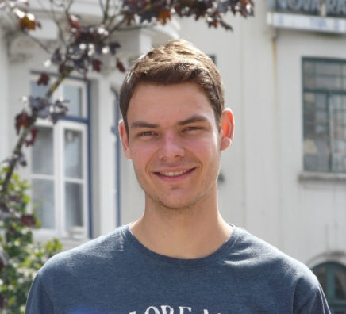
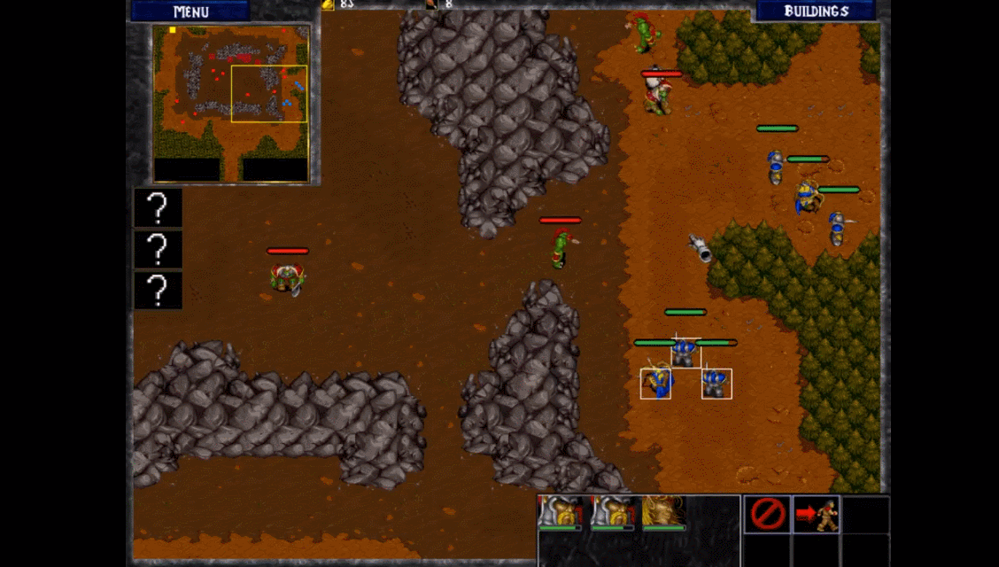
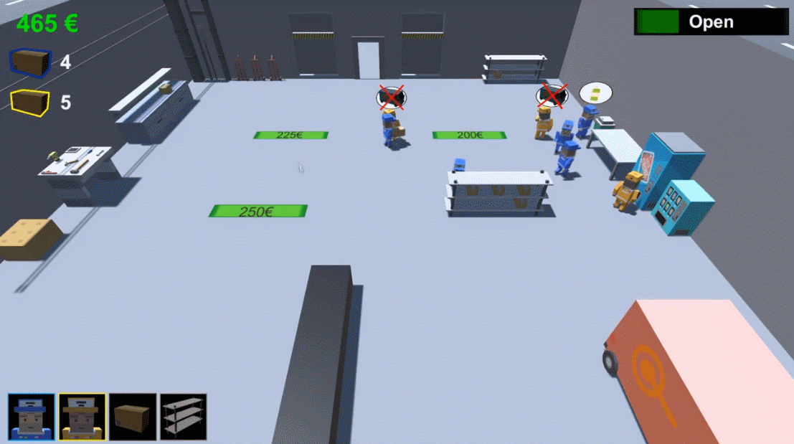
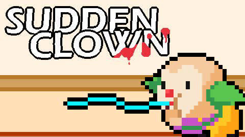

# AleixGabarro
<!DOCTYPE html>
<html >
<head>
  <!-- Site made with Mobirise Website Builder v4.8.10, https://mobirise.com -->
  <meta charset="UTF-8">
  <meta http-equiv="X-UA-Compatible" content="IE=edge">
  <meta name="generator" content="Mobirise v4.8.10, mobirise.com">
  <meta name="viewport" content="width=device-width, initial-scale=1, minimum-scale=1">
  <link rel="shortcut icon" href="assets/images/logo4.png" type="image/x-icon">
  <meta name="description" content="">
  <title>Home</title>
  <link rel="stylesheet" href="assets/tether/tether.min.css">
  <link rel="stylesheet" href="assets/bootstrap/css/bootstrap.min.css">
  <link rel="stylesheet" href="assets/bootstrap/css/bootstrap-grid.min.css">
  <link rel="stylesheet" href="assets/bootstrap/css/bootstrap-reboot.min.css">
  <link rel="stylesheet" href="assets/socicon/css/styles.css">
  <link rel="stylesheet" href="assets/theme/css/style.css">
  <link rel="stylesheet" href="assets/mobirise/css/mbr-additional.css" type="text/css">
  
  
  
</head>
<body>
  <section class="mbr-section content4 cid-rBj6IDcNBZ" id="content4-c">

    

    

        

            

                <h2 class="align-center pb-3 mbr-fonts-style display-1">
                    Aleix Gabarró</h2>
                
                
            

        

    

</section>

<section class="engine"><a href="https://mobirise.info/l">free site templates</a></section><section class="mbr-section content4 cid-rBj7Vjd8KV" id="content4-f">

    

    

        

            

                
                <h3 class="mbr-section-subtitle align-center mbr-light mbr-fonts-style display-2">
                    About Me</h3>
                
            

        

    

</section>

<section class="mbr-section content7 cid-rBj9UkayjK" id="content7-i">
          
    

    

        

            

                

                    

                        

                            
I am a student starting my 4th year of Video Game Design and Development Bachelor's degree at CITM (UPC). I have taken part of some projects in my university simulating an indie company between four and eighteen people. 
 Besides I practice sports like basketball and snowboard since I was child. Moreover I did differents volunteering during my High School in Barcelona with children and in some nursing homes&nbsp; 

                        

                    

                    

                       
                    

                

            

        

    

</section>

<section class="mbr-section content4 cid-rBoXgxNK5U" id="content4-y">

    

    

        

            

                
                
                
            

        

    

</section>

<section class="mbr-section content4 cid-rBjc0NyhGs" id="content4-l">

    

    

        

            

                <h2 class="align-center pb-3 mbr-fonts-style display-2">
                    Projects</h2>
                
                
            

        

    

</section>

<section class="features2 cid-rBjbMPAgeu" id="features2-k">

    

    
    
    

        

            

                

                    

                        
                    

                    

                        <h4 class="card-title pb-3 mbr-fonts-style display-7">
                            Alita Unbreakable Warrior</h4>
                        
This game is an action RPG  inspired in GUNNM universe, it was created with our engine using C++. In this project, I took part in almost all of the particle system and effects, labels of the UI, one part of the AI creating a frog with differents behaviours, improving our engine usability like multiselection to help our designers.  You can check our <a href="https://alitaunbreakablewarrior.github.io">web page</a>&nbsp;for more information and <a href="https://alita-unbreakablewarrior.github.io/_/aleix_gabarro.html">what I did </a>with details.

                    

                

            

            

                

                    

                        
                    

                    

                        <h4 class="card-title pb-3 mbr-fonts-style display-7">
                            Factory Engin3D</h4>
                        
You can check our <a href="https://factoryengin3d.github.io/index.html#header2-a">web page</a> for more information.

                    

                

            

            

            
        

    

</section>

<section class="features2 cid-rBjdltapRD" id="features2-m">

    

    
    
    

        

            

                

                    

                        
                    

                    

                        <h4 class="card-title pb-3 mbr-fonts-style display-7">Warcraft II: The Stolen Artifacts</h4>
                        
You can check our <a href="https://devcrumbs.github.io/Warcraft-II/">web page</a> for more information.
                        

                    

                

            

            

                

                    

                        
                    

                    

                        <h4 class="card-title pb-3 mbr-fonts-style display-7">
                            TransPort Factory</h4>
                        
You can check our <a href="https://transportfactory.bitbucket.io">web page</a> for more information.
                        

                    

                

            

            

            
        

    

</section>

<section class="mbr-section content4 cid-rBoX06e0sZ" id="content4-x">

    

    

        

            

                
                
                
            

        

    

</section>

<section class="mbr-section content4 cid-rBoGeTj6Ez" id="content4-n">

    

    

        

            

                <h2 class="align-center pb-3 mbr-fonts-style display-2">
                    Game Jams</h2>
                
                
            

        

    

</section>

<section class="mbr-section content4 cid-rBoLI6Fe4m" id="content4-t">

    

    

        

            

                <h2 class="align-center pb-3 mbr-fonts-style display-5"><strong>KAYAK</strong></h2>
                <h3 class="mbr-section-subtitle align-center mbr-light mbr-fonts-style display-7">Kayak is a game created in 30h during the 2nd CITM Game Jam. We had to create a video game with the sea's theme. This game is a 2vs2 race, and each team have to control one kayak padding in the right direction to stay straight and arrive before the other team. It was developed with Unity3D.
 &nbsp;Prices: Best award game - Popular game - Best design <a href="https://github.com/teamrocketo/Kayak">GitHub page</a>
                
</h3>
                
            

        

    

</section>

<section class="cid-rBoLQw7p9j" id="image1-u">

    

    <figure class="mbr-figure container">
            

                
                
            

    </figure>
</section>

<section class="mbr-section content4 cid-rBoMiWt362" id="content4-v">

    

    

        

            

                <h2 class="align-center pb-3 mbr-fonts-style display-5"><strong>SUDDEN CLOWN</strong></h2>
                <h3 class="mbr-section-subtitle align-center mbr-light mbr-fonts-style display-7">Sudden Clown is a game created in 30h during the 1st CITM Game Jam. The theme of this Game Jam was "Surprise". This is a stealth 2D game. You are a clown in a nursing home, and you have to kill all the old people with a party blower. You can hide in different objects while the nurses are coming to you. It was developed with Unity.  &nbsp;Prices: Popular game - Best art <a href="https://github.com/Mapdoth/Sudden-Clown">GitHub page</a>
                </h3>
                
            

        

    

</section>

<section class="cid-rBoMDuEFop" id="image1-w">

    

    <figure class="mbr-figure container">
            

                
                
            

    </figure>
</section>

<section class="mbr-section content4 cid-rBoXlEI7pK" id="content4-z">

    

    

        

            

                
                
                
            

        

    

</section>

<section once="" class="cid-rBj8wy4ka0" id="footer7-h">

    

    

    

        

            
            

                

                    
                    
                    
                    
                    
                    
                

                        <a href="https://github.com/aleixgab" target="_blank">
                            
                        </a>
                    

                        <a href="https://www.linkedin.com/in/aleix-gabarro-70699717b/" target="_blank">
                            
                        </a>
                    

                        <a href="https://twitter.com/aleix_gab" target="_blank">
                            
                        </a>
                    

                        <a href="https://www.instagram.com/aleix.gab/" target="_blank">
                            
                        </a>
                    

            

            

                
aleix.gab@gmail.com +34 638584648

            

        

    

</section>

  
  
  
  
  
  
  
  
</body>
</html>
